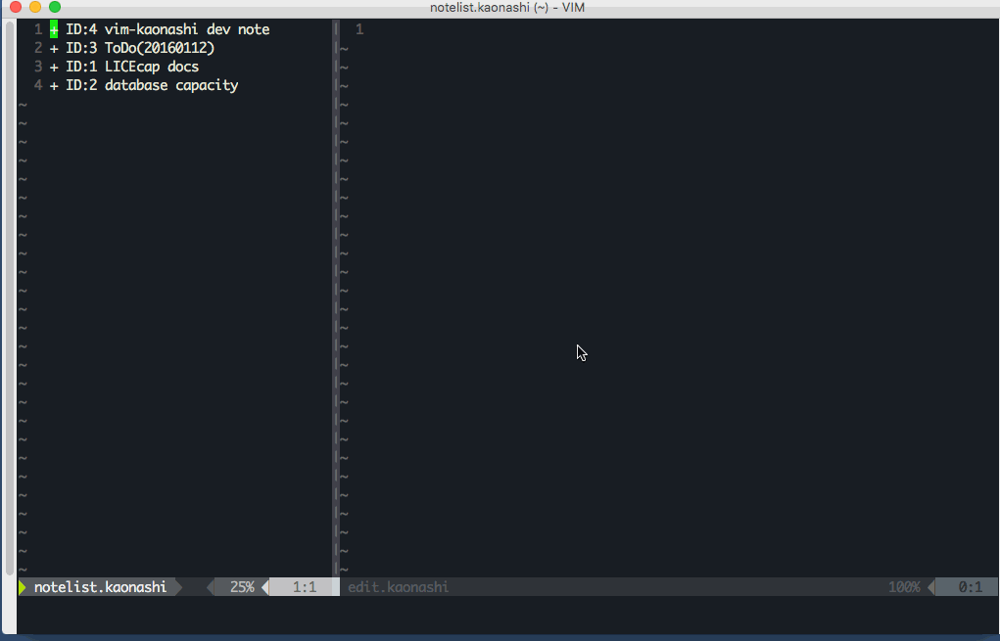

# vim-kaonashi

kaonashi vim/nvim UI

## Why created

I'm developing personal headless note app called [kaonashi](https://github.com/achiku/kaonashi). vim-kaonashi is one of the UIs for kaonashi.

## Demo

## Installation

Use your plugin manager of choice.

- [Pathogen](https://github.com/tpope/vim-pathogen)
  - `git clone https://github.com/achiku/vim-kaonashi ~/.vim/bundle/vim-kaonashi`
- [Vundle](https://github.com/gmarik/vundle)
  - Add `Bundle 'https://github.com/achiku/vim-kaonashi'` to .vimrc
  - Run `:BundleInstall`
- [NeoBundle](https://github.com/Shougo/neobundle.vim)
  - Add `NeoBundle 'https://github.com/achiku/vim-kaonashi'` to .vimrc
  - Run `:NeoBundleInstall`
- [vim-plug](https://github.com/junegunn/vim-plug)
  - Add `Plug 'https://github.com/achiku/vim-kaonashi'` to .vimrc
  - Run `:PlugInstall`
